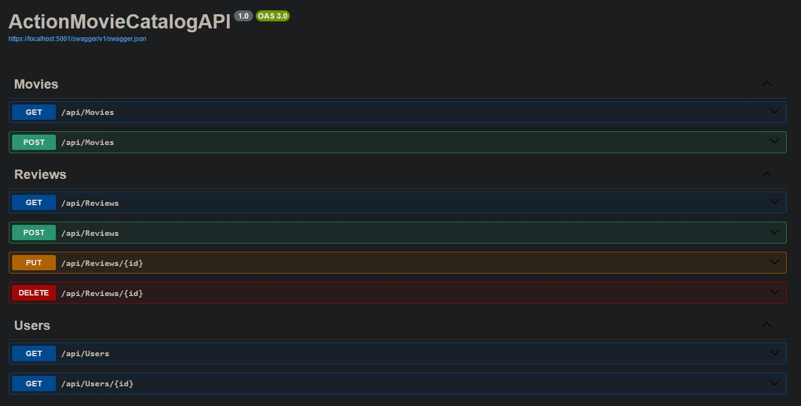

# Action Movie Catalog API

## Description
A RESTful API to manage a catalog of action movies, allowing users to add, search, update, remove movies, as well as rate and comment on them.

## Features
* Movie Management
  * List all movies
  * Search for movies by title, genre and other criteria
  * Add new movies
  * Edit existing movie information
  * Remove movies
* Ratings and Reviews
  * Add ratings and comments
  * View ratings and comments for a movie
**Users:**
  * Register new users
  * User login
  * Access permissions (e.g. users can edit their own comments)

## Technologies and Tools
- NET 8
- Oracle Database with Docker
- EFCore
- Swagger
- Dependency Injection
- Async/Await 

## API documentation
The interactive API documentation is available at:
https://localhost:5001/swagger/index.html

## Author
Keo Coelho